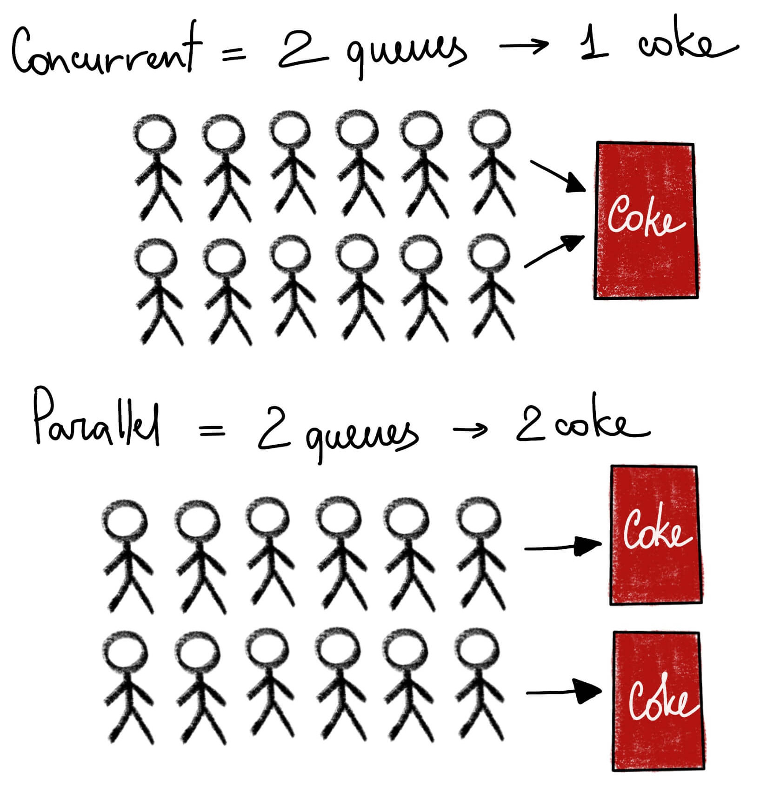
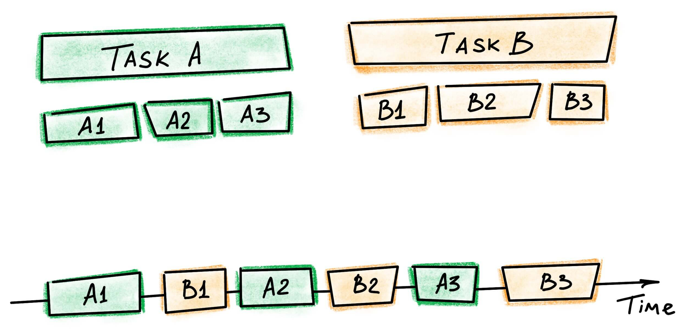
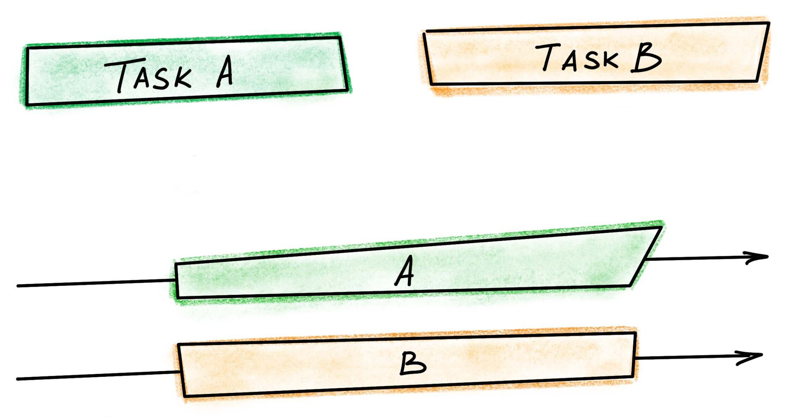
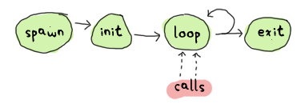

class: center, middle, inverse

# Playing With Elixir

### Have some delicious buzzwords

dynamic multi-paradigm programming language, declarative functional programming,
immutable data structures, meta programming with compile-time LISP-style macros,
open ad-hoc polymorphism with protocols, massive scalability, soft real-time
systems, high availability, maintainability, hot code swapping, low latency,
share-nothing message passing concurrency, preemptive scheduling, distribution,
fault tolerance, remote debugging, parallelized automated tests, documentation
generator, code formatter, doctests, test coverage

---

class: center, middle, inverse

# Agenda

.agenda[
1. Introduction to Elixir
2. The Erlang Concurrency Model
3. Demo: Highly Available & Fault Tolerant Elixir
4. Demo: Playing With Elixir
]

???

Disclaimer: WOW effect.

---

class: center, hidden-header

# Credits

.third-column.speaker[
**José Valim**


.sources[
* [Idioms for Building Distributed Fault-Tolerant Applications with Elixir • Curry On Barcelona 2017](https://youtu.be/MMfYXEH9KsY)
* The [Elixir](https://elixir-lang.org) community
]
]

.third-column.speaker[
**Joe Armstrong**


.sources[
* [How we program multicores • SICS Software Week 2016](https://www.youtube.com/watch?v=bo5WL5IQAd0)
* [Faults, Scaling, and Erlang Concurrency • Standford Seminar 2014](https://youtu.be/YaUPdgtUYko)
]
]

.third-column.speaker[
**Saša Jurić**


.sources[
[The Soul of Erlang and Elixir • GOTO 2019](https://gotocph.com/2019/sessions/1013/the-soul-of-erlang-and-elixir)
]
]

---

class: center, middle, inverse

# Introduction to Elixir

---

class: center-headers, middle

.half-column[
## Erlang

.center.muted.smaller[1986, open sourced in 1998]
.center.muted.smaller[[Prolog](https://en.wikipedia.org/wiki/Prolog)-like syntax]

```erlang
-module(hello).
-export([hello_world/0]).

hello_world() ->
  io:fwrite("Hello world!\n").
```
]

.half-column[
## Elixir

.center.muted.smaller[2012, v1 in 2014]
.center.muted.smaller[[Ruby](https://www.ruby-lang.org)-like syntax]

```elixir
defmodule Hello do
  def hello_world() do
    IO.puts "Hello World!"
  end
end
```
]

<div class="clear" />

.center[
Both are **compiled** and run on the [**BEAM virtual machine**](https://en.wikipedia.org/wiki/BEAM_%28Erlang_virtual_machine%29).
]

---

class: center, middle

.half-column[

]

.half-column[
## Origins

[Plataformatec](https://plataformatec.com/en/), a software consultancy founded in São Paulo, Brazil

R&D project led by José Valim, former member of the [Ruby on Rails](https://rubyonrails.org) core team

Elixir core team now an [independent open source organization](http://blog.plataformatec.com.br/2020/01/important-information-about-our-elixir-and-ruby-open-source-projects/)


]

???

Plataformatec [active in the Ruby community](https://plataformatec.com/en/why-us/ruby/):

* [Devise](https://github.com/heartcombo/devise)
* [Simple Form](https://github.com/heartcombo/simple_form)

Also contribute to the Elixir community:

* [Elixir](https://elixir-lang.org)
* [Ecto](https://hexdocs.pm/ecto/Ecto.html)
* [Phoenix](http://www.phoenixframework.org)

---

class: center, middle

## The Goals of Elixir

.elixir-goals[
* Productivity
* Extensibility
* Compatibility
]

---

class: center, middle


???

Started studying Erlang after trying to make Ruby on Rails thread-safe.

Trade-off: Ruby makes you happy. Java is performant.

It's a false dychotomy.

---

## Elixir 101 - Types

```elixir
$> iex
iex> 1         # integer
iex> 1.0       # float
iex> true      # boolean
iex> :atom     # atom / symbol
iex> "elixir"  # string (more or less...)
iex> self()    # pid (not yet...)
```

**Basic Structures**

```elixir
iex> [1, 2, 3]          # linked list
iex> {"life", 42}       # tuple
iex> %{"foo" => "bar"}  # map
```

**Atoms In Disguise**

```elixir
iex> nil === :nil      # true
iex> true === :true    # true
iex> false === :false  # true
```

---

## Elixir 101 - Modules & first-class functions

**Modules**

.half-column[
```elixir
defmodule Math do
  def add(a, b) do
    a + b
  end
end
```
]

.half-column[
```elixir
iex> Math.add(1, 2)
3
```

```elixir
iex> add = &Math.add/2
iex> add.(1, 2)
3
```
]

<div class='clear'></div>

**Anonymous functions**

.half-column[
```elixir
hello = fn name -> IO.puts "Hello #{name}" end
```
]

.half-column[
```elixir
iex> hello.("World")  # "Hello World"
:ok
```
]

<div class='clear' />

???

* Module not a class but a collection of functions (a namespace).
* No objects, no instantiation, no `this`.
* (Processes later.)

---

class: center, middle, inverse, hidden-header

## Functional programming


???

* *"FP emphasizes the evaluation of expressions rather than the execution of commands"*
* Pragmatic functional language, not religious about it like Haskell.
* 3 examples of what FP means in the context of Elixir.

---

### Immutability

```elixir
iex> person = %{first: "John", last: "Doe"}
iex> person_with_age = Map.put(person, :age, 40)
iex>
iex> person_with_age.first  # "John"
iex> person_with_age.age    # 40
iex> person.age             # nil
```

---

### Transformation

```elixir
fact = "Elixir Rocks"
String.upcase(List.first(String.split(fact, " ")))  # "ELIXIR"
```

--

.half-column[
```elixir
fact = "Elixir Rocks"
String.upcase(
  List.first(
    String.split(
      fact,
      " "
    )
  )
)  # "ELIXIR"
```
]

.half-column[
```elixir
fact = "Elixir Rocks"
fact_parts = String.split(fact, " ")
first_part = List.first(fact_parts)
String.upcase(first_part)  # "ELIXIR"
```
]

--

<br class='clear' />

```elixir
"Elixir Rocks"
|> String.split(" ")
|> List.first()
|> String.upcase()  # "ELIXIR"
```

???

* *"Functional programming is nothing more than transformation."*

---

### Pattern matching

```elixir
iex> a = 1
1

iex> 1 = a
1

iex> [1] = [1]
[1]
```

`=` is actually not an assignment operator in Elixir. It's called the **match operator**.

```elixir
iex> b = 2
iex> [1, ^b, [c]] = [1, 2, [3]]
[1, 2, [3]]

iex> c
3
```

---

### Pattern matching in functions

.half-column[
```elixir
defmodule Fibonacci do
  def fib(0) do
    0
  end

  def fib(1) do
    1
  end

  def fib(n) when n >= 2 do
    fib(n - 1) + fib(n - 2)
  end
end
```
]

.half-column[
```elixir
iex> import Fibonacci
Fibonacci

iex> fib 0
0
iex> fib 1
1
iex> fib 2
1
iex> fib 3
2
iex> fib 4
3

iex> fib -1
** (FunctionClauseError) no function clause
   matching in Fibonacci.fib/1

  The following arguments were given:

  # 1
  -1

  iex:2: Fibonacci.fib/1
```
]

---

### Doing it with Phoenix

```elixir
defmodule MyApp.MyController do
  use MyApp, :controller

  def get_authorization(%Conn{} = conn) do
    conn
    |> get_req_header("authorization")
    |> get_authorization()
  end

  def get_authorization([_, _ | _]) do
    {:error, :auth_header_duplicated}
  end

  def get_authorization(["Bearer " <> token]) do
    {:ok, token}
  end

  def get_authorization([_]) do
    {:error, :auth_header_malformed}
  end

  def get_authorization([]) do
    {:error, :auth_header_missing}
  end
end
```

???

https://github.com/tc39/proposal-pattern-matching

---

class: center, middle

## Meta programming

.lang-makeup[


]

???

The third language is Node.js.

---

### The Elixir Abstract Syntax Tree (AST) is in Elixir!

```elixir
iex> ast = quote do: 1 + 2
{:+, [context: Elixir, import: Kernel], [1, 2]}

iex> Macro.to_string(ast)
"1 + 2"
```

???

The Elixir AST is represented as a tuple of Elixir terms.

---

### What do I care?

```js
const { assert } = require('chai');

assert(1 == 2, 'damn, this is useless');

// AssertionError: damn, this is useless
//   value: false
```

---

### Unlimited Macro Power

```elixir
defmodule MyMacros do
  defmacro nice_assert({:==, _meta, [left, right]}) do
    quote do
      IO.puts """

      Left: #{unquote(left)}
      Right: #{unquote(right)}

      Match: #{unquote(left == right)}
      """
    end
  end
end
```

```elixir
iex> require MyMacros
iex> MyMacros.nice_assert 1 == 2

Left: 1
Right: 2

Match: false
```

???

Macros inspired by LISP.

[Kernel specialforms](https://hexdocs.pm/elixir/Kernel.SpecialForms.html#content)

---

### Macros Everywhere

This looks like some fundamental syntax of the language...

```elixir
if condition do
  do_this()
else
  do_that()
end
```

--

Actually, it's a macro:

```elixir
if(condition, do: do_this(), else: do_that())
```

So are these: `def`, `defmodule`, `|>`.

???

Macros are expanded at compilation time and must be explicitly imported.

You cannot affect an application's code from within your library's code.

---

### Domain Specific Languages Through Macros

*[Ecto](https://github.com/elixir-ecto/ecto): a toolkit for data mapping and language integrated query.*

```elixir
  from p in Post,
where: p.published_at < now and
       p.author == "José",
order: p.created_at
```

???

Ecto inspired from link (language integrated query) in .net, but it doesn’t have to be integrated into language.

It's just a compile-time macro, compiled as close as possible to SQL so there is no waste at runtime.

---

class: center, middle

## Modern programming language


---

### Your toolset

.toolset[
Tool                                                                                          | Installation   | w00t
:-------------------------------------------------------------------------------------------- | :------------- | :------------------------
Build Tool ([Mix](https://hexdocs.pm/mix/Mix.html))                                           | Out of the box | Live compilation
Package Manager ([Hex](https://hex.pm/))                                                      | Out of the box | Also for Erlang
Test Framework ([ExUnit](https://hexdocs.pm/ex_unit/ExUnit.html))                             | Out of the box | Coverage & parallel tests
Documentation Generator ([ExDoc](https://hexdocs.pm/ex_doc/readme.html))                      | Out of the box | Using Markdown
Code Formatter ([Elixir Formatter](https://hexdocs.pm/mix/master/Mix.Tasks.Format.html))      | Out of the box | Used in all official code
Production Release Bundler                                                                    | Out of the box | Unix & Windows
Debugging Tools ([Observer](https://elixir-lang.org/getting-started/debugging.html#observer)) | Out of the box | And more...
]

.center[

]

---

### Doctests

```elixir
defmodule HelloModule do
  @doc ~S"""
  This method salutes you.

  ## Examples

      iex> HelloModule.hello("Gladiator")
      "Hello Gladiator"

  """
  def hello(name) do
    "Hello #{name}"
  end
end
```

```elixir
defmodule HelloModuleTest do
  use ExUnit.Case, async: true
  doctest MyModule
end
```

---

## Fully compatible with Erlang

Modules are identified by atoms in both Erlang and Elixir:

```elixir
iex> Enum == :'Elixir.Enum'
true

iex> Enum.empty?([])
true

iex> :'Elixir.Enum'.empty?([])
true

iex> :rand.uniform()
0.8175669086010815

iex> Base.encode16(:crypto.hash(:sha256, "Elixir"))
"3315715A7A3AD57428298676C5AE465DADA38D951BDFAC9348A8A31E9C7401CB"
```

Call Erlang libraries with **no runtime cost**.

???

The Elixir compiler compiles the Elixir AST to Erlang AST, then gives it to the Erlang compiler.

---

## The power of the BEAM


Elixir runs on the BEAM virtual machine, taking full advantage of:

* Hundreds of Erlang libraries.
* 30+ years of experience running large scale systems.

---

class: center, middle, inverse

# The Erlang Concurrency Model

???

Everything that's about to be presented is true of Elixir as well.

---

class: center, middle

## Massively parallel problems

Global phone network, World Wide Web

WhatsApp, CouchDB, Riak, Rabbit MQ, Discord, Heroku


.copyright[© Learn You Some Erlang for Great Good]

???

Massively parallel problems are extremely common.

The way Erlang is used at least proves the model works.

**Joe Armstrong's vision.**

---

class: center, middle

*"Why doesn't my program run N times faster on an N-core computer?"*

.muted.smaller[Anonymous programmer]

???

One of the aforementioned problems of the last 15 years.

---

class: center, middle, hidden-header

## Programming for multicores


???

You have to write parallel programs to take advantage of the increase in the
number of CPU cores.

---

class: center, middle

## Parallel programs


???

Extremely difficult to get right.

---

class: center

## Concurrent (and parallel?) programming

.half-column[
### Shared memory

C, C++, Python, Perl, Ruby, PHP, Java, JavaScript, Smalltalk, Objective-C, C#,
Swift, Fortran, Pascal, ML, Oberon, Ada, BCPL, Basic, F#, Lua, Lis, Prolog,
Miranda, Haskell, Go, Simula
]

.half-column[
### Message passing

Erlang, Elixir, Pony
]

???

A few of the languages on the left also have message passing like Go or Scala,
but they still do shared memory concurrency.

---

class: center

## Concurrent (and parallel?) programming

.half-column[
### Shared memory

C, C++, Python, Perl, Ruby, PHP, Java, JavaScript, Smalltalk, Objective-C, C#,
Swift, Fortran, Pascal, ML, Oberon, Ada, BCPL, Basic, F#, Lua, Lis, Prolog,
Miranda, Haskell, Go, Simula


]

.half-column[
### Message passing

Erlang, Elixir, Pony


]

---

class: center, middle


???

Back to the past.

Ericsson had large computer networks before the internet (20-30 years).

Erlang was designed for big worldwide infrastructure by Joe Armstrong, Robert
Virding & Mike Williams in the Computer Science Lab at Ericsson.

A language born in the industry.

---

class: center, middle

AXD301 Asynchronous Transfer Mode (ATM) Telephone Switch (1998)


Over 1,000,000 lines of Erlang. The mythical nine "9"s of availability.

---

class: center, middle


.copyright[© Idioms for Building Distributed Fault-Tolerant Applications with Elixir • José Valim • Curry On Barcelona 2017]

???

* Must support many concurrent users.
* Must be distributed.
* Must not fail.

---

class: center, middle

## The Goals of Erlang (1986)

.erlang-goals.large[
* Concurrency
* Fault Tolerance
]

---

class: center, middle, inverse

.erlang-goals.large[
Concurrency
]

---

class: center, middle



.copyright[© luminousmen.com]

---

class: center, middle

.half-column[
### Concurrency


]

.half-column[
### Parallelism


]

.clear[
.copyright[© luminousmen.com]
]

???

True parallelism impossible on single core (pipelining, hyperthreading,
superscalar processor).

---

class: center, middle

.half-column[
* *"We want to make it easy to write parallel programs. We can't."*

.muted.smaller[Joe Armstrong]
]

.half-column[
* *"But we can make it relatively easy to write a concurrent program."*

.muted.smaller[Joe Armstrong]
]

???

Parallel programming hard because have to think about how threads are going to interfere with sequential code.

---

## Problems with languages using shared memory concurrency

* **Concurrency is handled by the operating system**, not the programming language.

* Sequential language have the **wrong primitives** for parallel programming.

* Simultaneity (shared memory access) **violates the laws of physics**.

---

class: center

## Physicists...

.half-column[


*"Please don't violate the laws of physics."*

.muted[Joe Armstrong]
]

.half-column[


*"He might be on to something."*

.muted[Some physicist]
]

???

There is no such thing as simultaneity in physics.

*"Erlang also violates the laws of physics, but it violates far fewer of them."*

---

class: center, middle

*"Make it right before you make it fast."*

*"Make it beautiful before you make it faster."*

*"Keep it right when you make it faster."*

.muted.smaller[Joe Armstrong]

???

Erlang was designed caring about correctness, not efficiency or performance.

Efficiency comes from parallelism.

---

class: center, middle

## Erlang

.erlang-process[
Process
]

Lightweight. **Not** an OS process.

Simple dynamic functional language.

Purely sequential, easy to understand.

???

Very lightweight compared to OS process:

* Smallest OS process: ~64kB.
* Erlang process [309
  words](http://erlang.org/doc/efficiency_guide/processes.html), including 233
  for the heap (~2.4kB for 64 bit architecture).

Beam VM can run a maximum of about 130 million processes (source?).

---

class: center, middle

## Message passing


.copyright[© Learn You Some Erlang for Great Good]

---

## 3 concurrency primitives

Provided by the BEAM (not the OS): spawn, send, receive.

.half-column[
```erlang
% Create a parallel process to evaluate F.
Pid = spawn(F)

% Send a message to F.
Pid ! M

% Wait for messages matching patterns
% to arrive in the mailbox.
receive
  Pattern1 -> Actions1;
  Pattern2 -> Actions2;
after
  1000 -> Actions
end.
```
]

.half-column[
```elixir
# Create a parallel process to evaluate f.
pid = spawn(f)

# Send a message to f.
send(pid, msg)

# Wait for messages matching patterns
# to arrive in the mailbox.
receive do
  pattern1 -> actions1
  pattern2 -> actions2
after
  1_000 -> actions
end
```
]

???

Concurrent programming should be at the lowest level possible in the programming language.

Spawn, send and receive are language primitives compiled to single BEAM instructions.

---

.half-column[
## No

* Shared memory
* Pointers
* Semaphores
* Mutexes
* Monitors
* Spin locks
* Critical regions
* Futures
* Promises
* Locks
* Caches
* Threads
* Thread safety
]

.half-column[
## Just

* Pure message passing

.muted.smaller[*Yeah, right...*]
]

???

Does not mean there are no synchronization problems or race conditions, but the goal is to make it easier to understand.

---

class: center, middle

## Isolated processes

Each with their own stack & heap and separately garbage-collected.

No pointer/reference: everything is copied and immutable.


.copyright[© Idioms for Building Distributed Fault-Tolerant Applications with Elixir • José Valim • Curry On Barcelona 2017]

???

Isolated processes communicate through asynchronous message passing.

Trade-off: isolation has a cost (copying), but also benefits like no
stop-the-world garbage collection. **More on that later.**

Not religious FP immutability: ETS tables don't change the entire universe every
time you change something in it. Otherwise it would be hard to implement a
database with Erlang (e.g. CouchDB, Riak).

---

class: center, middle

## Obey the laws of physics!

### Causality

* Messages travel at or under the speed of light.

* We only know how things were, not how they are.

* Simultaneity is impossible!

### Real-world failure semantics

* You either get the message or you don't, and you'll never know.

???

Messages travel at the speed of light. If A and B are separated in space and B
depends on the state of A, A must send a message to B before B can do anything.

---

class: center, middle

## Actor model

Code is based on **observation**.


.copyright[© How we program multicores • Joe Armstrong • SICS Software Week 2016]

???

[History of the Actor Model](https://en.wikipedia.org/wiki/History_of_the_Actor_model)

.smaller[
* **Single site** where things happen: each process is a single place
  synchronously consuming a single stream of events.
* **Process granularity** is defined by observing the world (e.g. phone
  conversation).
* A million users: a million processes. **The concurrency of the system is
  reflected in the architecture**.
* Easily 1000+ Erlang processes in an application.
* A classic web server (Apache) with shared memory has to spawn OS processes.
  Cannot handle more than 10k. An Erlang web server uses isolated processes.
]

---

class: center, middle

## Scheduling processes on multicores is (NP-)hard


Especially when you're packing great big rocks (OS processes).

???

It's an NP-hard problem.

---

class: center, middle

## But packing sand is easy


.copyright[© Patrik Nyblom • Erlang Factory 2010]

???

3 registers moved when context-switching between Erlang processes, ~700 words
moved for OS processes (source?).

---

class: center, middle

## The BEAM VM's architecture

A single OS process, one scheduler per CPU core.


.copyright[© Riza Fahmi]

???

Erlang processes are concurrent. All processes run in parallel (in theory). On a
multicore machine, the processes are spread over the cores.

2-3 people at Ericsson know how to do it. Let them do it.

Show observer.

---

class: center, middle, inverse

.erlang-goals.large[
Fault Tolerance
]

---

class: center, middle


.copyright[VectorStock®]

---

class: center, middle


???

Software faults, hardware faults.

We need to make fault tolerant programs that handle both.

---

class: center, middle

## The "lasers and cacti" model of fault tolerance


.copyright[© Learn You Some Erlang for Great Good]

???

How do we make fault tolerant programs in the presence of hardware failure?

---

class: center, middle

* *"We cannot make fault-tolerant systems on one machine. [...] What happens if the entire computer crashes?"*

.muted.smaller[Joe Armstrong]

???

You need to distribute your program across several computers to make it fault
tolerant.

---

class: center, middle

* *"You cannot do distributed computing without message passing. It's impossible."*

.muted.smaller[Joe Armstrong]

???

Physically separate programs need to communicate through some kind of message
passing, e.g. HTTP.

---

class: center, middle

## Another problem with shared memory

* Single- or multi-core: use shared memory.
* Distributed computation: use message passing.

Two different programming models depending on the scale of the system.

---

class: center, middle

## Erlang

One programming model to rule them all.


.copyright[© Idioms for Building Distributed Fault-Tolerant Applications with Elixir • José Valim • Curry On Barcelona 2017]

???

Concurrency is a special case of distribution where all processes are on the same machine.

---

class: center, middle

## Where process isolation comes in handy

More computers can increase the **reliability** of your system as long as they are **independent** from each other.

Copying (message pasing) is inefficient but required for fault tolerance.

---

class: center, middle

## Unintended consequences

Fault tolerance implies using isolated components (Erlang processes).

If the components are isolated they can be run in parallel.

Things that are isolated and can be run in parallel are scalable.

**Free scalability!**

???

[Tandem computers](https://en.wikipedia.org/wiki/Tandem_Computers) also noticed FT scales quite well.

---

class: middle

## Make it right before you make it fast

.half-column[
**Q:** *"Did you have to change the original design to make it faster?"*
]

--

.half-column[
**A:** *"No it just went faster."*
]

???

The goal in Erlang is that a program with a reasonable balance of processes scales automatically on multicores (0.75).

---

class: center, middle

## Okay, but how do we handle crashes?


---

class: center, middle

## We like to write correct programs

But it's virtually impossible to write big correct programs.


Programs must handle errors, evolve and run forever.

---

class: center, middle

## It's alive!

A computer system should be treated as a biological system:

* Failure is an inherent part of its operation.
* We have to detect it and recover from it.

.muted.smaller[Von Neumann]

---

class: center, middle

## This is how Erlang does it


---

class: center, middle


.smaller[Also known as [Fail Fast](https://en.wikipedia.org/wiki/Fail-fast).]

---

class: center, middle

*"[Defensive programming](https://en.wikipedia.org/wiki/Defensive_programming) is a consequence of a bad concurrency model."*

.muted.smaller[Joe Armstrong]

???

Do not be lenient with input: programs should crash when going off spec.

In a sequential program you **lose everything** and affect everyone if it
crashes.

In Erlang you can have **as many processes as you want**. It's a **different
failure model**: instead of one very fast delivery car, you have many little
taxis. You don’t care if a few fail.

---

class: center, middle

## The Bohrbug/Heisenbug hypothesis

*"[...] **Most production software faults are soft.** If the program state is
reinitialised and the failed operation retried, the operation will usually not
fail the second time."*

.muted.smaller[Jim Gray]

.copyright[Why Do Computers Stop and What Can Be Done About It? • Tandem Technical Report 1985]

---

class: middle

## Ease of finding bugs in production

Repeatable bugs should be handled by testing (manual or automated).

<table class='software-fault-types'>
  <thead>
    <tr>
      <td></td>
      <th>Repeatable</th>
      <th>Transient</th>
    </tr>
  </thead>
  <tbody>
    <tr>
      <th>Core feature</th>
      <td>Easy to find</td>
      <td>Hard to find</td>
    </tr>
    <tr>
      <th>Secondary feature</th>
      <td>Often overlooked</td>
      <td>Hard to find</td>
    </tr>
  </tbody>
</table>

.copyright[© The Zen of Erlang]

---

class: middle

## Frequency of bugs in production

Transient bugs happen all the time in production.

<table class='software-fault-types'>
  <thead>
    <tr>
      <td></td>
      <th>Repeatable</th>
      <th>Transient</th>
    </tr>
  </thead>
  <tbody>
    <tr>
      <th>Core feature</th>
      <td>Should never happen</td>
      <td>All the time</td>
    </tr>
    <tr>
      <th>Secondary feature</th>
      <td>Pretty often</td>
      <td>All the time</td>
    </tr>
  </tbody>
</table>

.copyright[© The Zen of Erlang]

---

class: middle

## Bugs handled by restarts

Restarting helps dealing with transient bugs caused by a very specific state.

<table class='software-fault-types'>
  <thead>
    <tr>
      <td></td>
      <th>Repeatable</th>
      <th>Transient</th>
    </tr>
  </thead>
  <tbody>
    <tr>
      <th>Core feature</th>
      <td>No</td>
      <td class='highlight'>Yes</td>
    </tr>
    <tr>
      <th>Secondary feature</th>
      <td>No</td>
      <td class='highlight'>Yes</td>
    </tr>
  </tbody>
</table>

.copyright[© The Zen of Erlang]

---

class: center, middle

## Links

A process can monitor another process (whether local or remote).

If a process crashes, someone else must handle the problem.


.copyright[© Learn You Some Erlang for Great Good]

???

You might have an inconsistent state: let somebody else fix the problem.

If you have a heart attack, you cannot fix the problem yourself.

---

class: center, middle

## Open Telecom Platform (OTP)

The aforementioned "30+ years of experience".


.copyright[© Learn You Some Erlang for Great Good]

???

OTP is like the Ruby standard library or like Unix for C: a large set of libraries for the Erlang programming language.

---

class: center, middle

## GenServer

Common abstractions.



.copyright[© Learn You Some Erlang for Great Good]

---

class: center, middle

## Supervision trees

Just let it crash already!


.copyright[© Learn You Some Erlang for Great Good]

???

Generally workers do the work while supervisors only handle supervision,
although there can be exceptions (Phoenix channel TCP acceptor).

---

class: center, middle

## A supervision strategy for each use case

.supervision-strategies[


]

.copyright[© Learn You Some Erlang for Great Good]

???

[Who Supervises The Supervisors?](https://learnyousomeerlang.com/supervisors)

Supervisors can be configured to only let a supervised process crashed a maximum
number of times, after which it will crash itself.

---

class: center, middle, inverse

--

# DEMO TIME

---

## Sources

**Main Inspiration (Videos)**

.sources[
* [How we program multicores • Joe Armstrong • SICS Software Week 2016](https://youtu.be/bo5WL5IQAd0)
* [Idioms for Building Distributed Fault-Tolerant Applications with Elixir • José Valim • Curry On Barcelona 2017](https://youtu.be/MMfYXEH9KsY)
* [The Soul of Erlang and Elixir • Saša Jurić • GOTO 2019](https://youtu.be/JvBT4XBdoUE)
* [Faults, Scaling, and Erlang Concurrency • Stanford Seminar 2014](https://youtu.be/YaUPdgtUYko)
* [The Zen of Erlang • Fred Hebert • Reactive Summit 2016](https://youtu.be/4ZIPijEqrNI)
]

**Books**

.sources[
* [Learn You Some Erlang For Great Good](https://learnyousomeerlang.com)
* [Stuff Goes Bad: Erlang in Anger](https://www.erlang-in-anger.com)
]

---

## Sources • Erlang Videos

.sources[
* [Erlang: The Movie](https://www.youtube.com/watch?v=xrIjfIjssLE)
* [Computer Science — A Guide for the Perplexed • Joe Armstrong • GOTO 2018](https://youtu.be/rmueBVrLKcY)
* [The Do's and Don'ts of Error Handling • Joe Armstrong • GOTO 2018](https://youtu.be/TTM_b7EJg5E)
* [Breaking Open: Erlang • Joe Armstrong](https://youtu.be/m5RWdNBPsTY)
* [Let's #TalkConcurrency with Joe Armstrong • Cambridge University 2018](https://youtu.be/i9Kf12NMPWE)
* [Why We Chose Erlang over Java, Scala, Go, C • Colin Hemmings • QCon London 2017](https://youtu.be/OcExABAAsXs)
* [Hitchhiker's Tour of the BEAM • Robert Virding • Erlang User Conference 2014](https://youtu.be/_Pwlvy3zz9M)
* [Building A Highly Scalable Service that Survived A Super Bowl • Keith Elder • Code BEAM SF 19](https://youtu.be/lXiiiLhwBI4)
]

---

## Sources • Elixir Videos

.sources[
.half-column[
* [Elixir — A Mini-Documentary](https://youtu.be/lxYFOM3UJzo)
* [The Climb: Experiencing the Rise of Elixir from the Inside • Erlang Factory SF 2016](https://youtu.be/fklep3sUSWo)
* [Phoenix and Elm — Making the Web Functional • Erlang Factory SF 2016 Keynote](https://youtu.be/XJ9ckqCMiKk)
* [Don't Write Macros But Do Learn How They Work • Jesse Anderson • ElixirConf 2017](https://youtu.be/Bo48sQDb-hk)
* [Elixir in Elixir • Jay Hayes • ElixirConf 2016](https://youtu.be/p8MGNw045AE)
* [Write Less, Do More (and Have Fun!) with Elixir Macros • Erlang Factory 2014](https://youtu.be/mkoYqXdXl5Y)
* [High Availability • Saša Jurić • ElixirConf EU 2015](https://youtu.be/wYttHG3S76Y)
* [The ABCs of OTP • Jesse J. Anderson • EEF17 Conference](https://youtu.be/4SCwubzqsVU)
* [What every Node.js developer needs to know about Elixir • Bryan Hunter • NDC Conferences 2016](https://youtu.be/q8wueg2hswA)
* [Keynote: Phoenix 1.3 • Chris McCord • Lonestar ElixirConf 2017](https://youtu.be/tMO28ar0lW8)
* [Elixir Umbrella — Microservices or Majestic Monolith? • Georgina McFadyen • Elixir.LDN 2017](https://youtu.be/jhZwQ1LTdUI)
* [Perhap: Applying Domain Driven Design and Reactive Architectures to Functional Programming • Rob Martin • ElixirConf 2017](https://youtu.be/kq4qTk18N-c)
]
.half-column[
* [Solid Ground • Saša Jurić • EMPEX Conference 2017](https://youtu.be/pO4_Wlq8JeI)
* [Elixir: The only Sane Choice in an Insane World • Brian Cardarella • GOTO 2017](https://youtu.be/gom6nEvtl3U)
* [Phoenix a Web Framework for the New Web • José Valim • GOTO 2016](https://youtu.be/bk3icU8iIto)
* [Why Elixir Matters: A Genealogy of Functional Programming • Osayame Gaius-Obaseki • ElixirDaze 2018](https://youtu.be/cWAHpvkh8Vs)
* [Discovering Processes • Saša Jurić • ElixirConfEU 2016](https://youtu.be/y_b6RTes83c)
* [High Availability with Elixir and Erlang • Saša Jurić • Full Stack Fest 2016](https://youtu.be/Ba3aCm3A0o8)
* [Intro to OTP in Elixir • Jesse J. Anderson • Full Stack Talks 2016](https://youtu.be/CJT8wPnmjTM)
* [Processes and Supervision in Elixir • Steve Grossi • Indy Elixir 2016](https://youtu.be/eUxang6_WQA)
* [Docker and OTP Friends or Foes • Daniel Azuma • ElixirConf 2018](https://youtu.be/nLApFANtkHs)
* [Phoenix a Web Framework for the New Web • Jose Valim • Lambda Days 2016](https://youtu.be/MD3P7Qan3pw)
* [Consistent, Distributed Elixir • Chris Keathley • ElixirDaze 2018](https://youtu.be/CmMMpaUD3g8)
* [What the Fuss About Phoenix • Saša Jurić • WebCamp Zagreb 2016](https://youtu.be/3uJCwcBwfh4)
]
]

---

## Sources • Miscellaneous

**Presentations**

.sources[
* [The Zen Of Erlang](https://ferd.ca/the-zen-of-erlang.html)
* [An Introduction to Erlang • Mirko Bonadei](https://www.slideshare.net/MirkoBonadei/an-introduction-to-erlang)
]

**Articles & Papers**

.sources[
* [Which Companies are Using Erlang and why? • Erlang Solutions](https://www.erlang-solutions.com/blog/which-companies-are-using-erlang-and-why-mytopdogstatus.html)
* [Stuff Goes Bad • Fred Herbert • Heroku 2014](https://blog.heroku.com/erlang-in-anger)
* [Convenience Over Correctness • Steve Vinoski • IEEE](http://steve.vinoski.net/pdf/IEEE-Convenience_Over_Correctness.pdf)
* [Using Rust to Scale Elixir for 11 Million Concurrent Users • Matt Nowack • Discord](https://blog.discordapp.com/using-rust-to-scale-elixir-for-11-million-concurrent-users-c6f19fc029d3)
* [Robust compute for RDF queries • Managing fault tolerance in Elixir with supervision trees • Tonny Hammond](https://medium.com/@tonyhammond/robust-compute-for-rdf-queries-eb2ad665ef12)
* [Understanding Elixir Macros • Jorge Chávez - Hackernoon](https://hackernoon.com/understanding-elixir-macros-3464e141434c)
* [Understanding Elixir Macros • Saša Jurić](https://www.theerlangelist.com/article/macros_1)
* [Erlang Concurrency • Sudhakar Rayavaram 2017](https://www.sudhakar.online/programming/2017/01/29/elixir-concurrency.html)
* [Why Do Computers Stop and What Can Be Done About It? • Jim Gray • Tandem Technical Report 1985](https://www.hpl.hp.com/techreports/tandem/TR-85.7.pdf)
]

---

class: center, inverse, middle

## [heig.ch/elixirBB](https://heig.ch/elixirBB)

---

class: center, middle, inverse

## Backup

---

### Elixir 101 - Strings... but are they really?

There are actually no strings in Elixir, just binaries:

```elixir
iex> is_string("foo")
** (CompileError) iex:10: undefined function is_string/1
iex> is_binary("foo")
true
iex> <<102, 111, 111>> == "foo"
true
iex> <<256 :: utf8>> == "Ā"
true
iex> <<196, 128>> == "Ā"
true
```

And actually, binaries are just bitstrings with a number of bits divisible by 8:

```elixir
iex> is_bitstring("foo")
true
iex> <<102 :: size(8), 111 :: size(8), 111 :: size(8)>>
"foo"
iex> <<2::size(2), 3 :: size(3)>>  # 10011
<<19::size(5)>>
```

---

### Native Implemented Functions (NIFs)

[Using Rust to Scale Elixir for 11 Million Concurrent Users](https://blog.discordapp.com/using-rust-to-scale-elixir-for-11-million-concurrent-users-c6f19fc029d3)